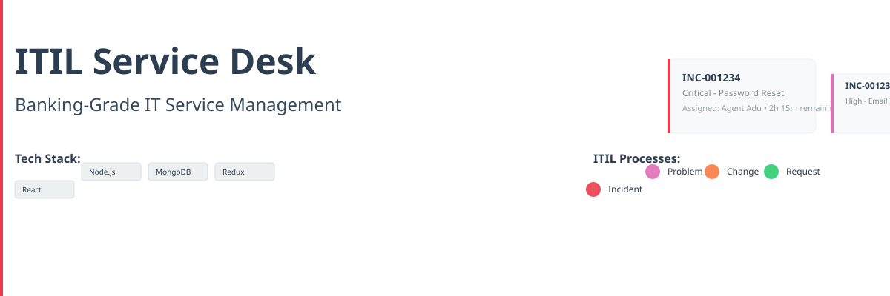

# ���� �� �� 🎖������️ ITIL-Aligned Service Desk



> **A production-grade MERN stack service desk for banking operations environments.**  
> Implements ITIL incident management, tiered escalation, SLA enforcement, knowledge base, audit logging, and full analytics + reporting dashboard.


---

## ���� �� �� 🏆 Key Features

<table>
<tr>
<td>������✅ <strong>ITIL-Compliant Incident Management</strong></td>
<td>������⚡ <strong>Automated SLA Enforcement</strong></td>
</tr>
<tr>
<td>Full lifecycle tracking from creation to resolution</td>
<td>Real-time breach monitoring with priority-based targets</td>
</tr>
<tr>
<td>���������🔄 <strong>Multi-Tier Escalation</strong></td>
<td>���������📚 <strong>Knowledge Base</strong></td>
</tr>
<tr>
<td>Automatic routing based on SLA timelines</td>
<td>Searchable article repository for faster resolution</td>
</tr>
<tr>
<td>���������🔒 <strong>Audit Logging</strong></td>
<td>���������📊 <strong>Analytics Dashboard</strong></td>
</tr>
<tr>
<td>Immutable, blockchain-style tracking of all actions</td>
<td>Visual reporting on ticket volume, agent performance, and SLA compliance</td>
</tr>
<tr>
<td>���������👥 <strong>Role-Based Access Control</strong></td>
<td>���������📧 <strong>Email Integration</strong></td>
</tr>
<tr>
<td>Four-tier permission system (end_user → admin)</td>
<td>Automated notifications for ticket updates and escalations</td>
</tr>
<tr>
<td>���������🔌 <strong>RESTful API</strong></td>
<td>���������🚀 <strong>Production Ready</strong></td>
</tr>
<td>Comprehensive backend services with JWT authentication</td>
<td>Docker-configured, CI/CD pipeline, and deployment guides</td>
</tr>
</table>

---

## ���� �� �� 💻 Tech Stack

<table>
<tr>
<th>Layer</th>
<th>Technology</th>
<th>Version</th>
</tr>
<tr>
<td>Language</td>
<td>JavaScript (Node.js)</td>
<td>18+</td>
</tr>
<tr>
<td>Backend Framework</td>
<td>Express.js</td>
<td>4.18.3</td>
</tr>
<tr>
<td>Frontend Framework</td>
<td>React</td>
<td>18.2.0</td>
</tr>
<tr>
<td>State Management</td>
<td>Redux Toolkit</td>
<td>2.2.1</td>
</tr>
<tr>
<td>Database</td>
<td>MongoDB (via Mongoose)</td>
<td>8.2.2</td>
</tr>
<tr>
<td>Build Tool</td>
<td>npm-scripts</td>
<td>-</td>
</tr>
<tr>
<td>Testing</td>
<td>Jest (backend), React Testing Library (frontend)</td>
<td>-</td>
</tr>
<tr>
<td>CI/CD</td>
<td>GitHub Actions</td>
<td>-</td>
</tr>
<tr>
<td>Deployment</td>
<td>Vercel (frontend), Railway/Render (backend)</td>
<td>-</td>
</tr>
</table>

---

## ���� �� �� 💻 Quick Start (Local — 5 steps)

### ���� �� �� 🔧 Prerequisites

<table>
<tr>
<th>Tool</th>
<th>Version</th>
<th>Install</th>
</tr>
<tr>
<td>Node.js</td>
<td>18+</td>
<td>https://nodejs.org</td>
</tr>
<tr>
<td>npm</td>
<td>9+</td>
<td>bundled with Node</td>
</tr>
<tr>
<td>MongoDB</td>
<td>6+</td>
<td><a href="https://www.mongodb.com/try/download/community">Community</a> or <a href="https://www.mongodb.com/try/download/community">MongoDB Atlas</a></td>
</tr>
</table>

### 1������️������⃣ Clone the project

```bash
git clone https://github.com/s-aduk/itil-servicedesk.git
cd itil-servicedesk
```

### 2������️������⃣ Install dependencies

```bash
npm run install:all
```

### 3������️������⃣ Set up database

Choose **local** (recommended) or **Atlas**:

**Local:**
```bash
# Install & start MongoDB
brew install mongodb-community # macOS
# or: https://www.mongodb.com/try/download/community

# Start server
mongod --dbpath /usr/local/var/mongodb
```

**Atlas:** Follow [MongoDB Atlas setup guide](https://www.mongodb.com/basics/mongodb-atlas-tutorial)

### 4������️������⃣ Configure environment

```bash
cd backend
cp .env.example .env
# Edit .env with your MongoDB URI and JWT secrets
```

### 5������️������⃣ Run the application

```bash
# From project root:
npm run dev

# Access:
# http://localhost:3000 (frontend)
# http://localhost:5000 (backend API)
```

---

## ���� �� �� 👨‍���💻 Developer Highlights

- **Clean Architecture:** Separation of concerns with controllers, services, and models
- **Type Safety:** Runtime validation with express-validator and MongoDB schemas
- **Performance:** Lean queries, proper indexing, and aggregation pipelines for reports
- **Security:** Helmet, mongo-sanitize, rate limiting, and DOMPurify for XSS protection
- **Observability:** Comprehensive audit logging with blockchain-style hash chaining
- **Scalability:** Designed for horizontal scaling with stateless services
- **Maintainability:** Consistent error handling and standardized API response format

---

## ���� �� �� 🚀 Production Deployment

### ���� �� �� 🏗������️ Architecture

<table>
<tr>
<th>Component</th>
<th>Platform</th>
<th>Notes</th>
</tr>
<tr>
<td>Frontend</td>
<td>Vercel</td>
<td>Free tier, auto-deploy from GitHub</td>
</tr>
<tr>
<td>Backend</td>
<td>Railway or Render</td>
<td>Free tier available</td>
</tr>
<tr>
<td>Database</td>
<td>MongoDB Atlas</td>
<td>M0 free tier for low traffic; M10+ for production SLA</td>
</tr>
</table>

### ���� �� �� 📦 Deploy to Production

#### 1. MongoDB Atlas (production)

Use **M10+ cluster** for production SLA, restrict network access to backend IP only.

#### 2. Deploy Backend

**Railway:**
1. Connect GitHub repo
2. Set root directory to `backend`
3. Add environment variables from `.env`
4. Deploy - Railway runs `npm start`

**Render:**
1. Create new Web Service
2. Connect repo, root directory = `backend`
3. Build: `npm install`, Start: `node index.js`
4. Add environment variables

#### 3. Deploy Frontend

**Vercel:**
1. Import GitHub repo
2. Set root directory to `frontend`
3. Add `REACT_APP_API_URL` environment variable
4. Deploy - Vercel runs `npm run build`

#### 4. Update CORS

Set `CLIENT_URL` in backend to exact Vercel frontend URL for secure CORS policy.

---

## ���� � �� ✅ Production Checklist

- [ ] `NODE_ENV=production` on backend
- [ ] `MONGODB_URI` points to Atlas M10+ cluster
- [ ] `JWT_SECRET` & `JWT_REFRESH_SECRET` are 64+ char random strings
- [ ] `CLIENT_URL` matches Vercel URL exactly
- [ ] Atlas network access restricted to backend IP only
- [ ] Health check: `GET https://backend-url/api/health` returns 200
- [ ] End-to-end login flow functional
- [ ] SLA tracking verified with test ticket
- [ ] First user promoted to admin role
- [ ] Reports dashboard accessible to managers/admins
- [ ] No `.env` files or secrets in repository

---

## ���� �� �� 📁 Project Structure

```
itil-servicedesk/
│
├── backend/                  ← Express API (port 5000)
│   ├── config/               → Configuration files
│   ├── controllers/          → Request handlers (thin layer)
│   ├── middleware/           → Custom middleware (auth, errors)
│   ├── models/               → Mongoose schemas
│   ├── routes/               → API route definitions
│   ├── services/             → Business logic layer
│   └── utils/                → Helper functions
│
├── frontend/                 ← React app (port 3000)
│   ├── public/               → Static assets
│   └── src/                  → React source
│       ├── components/       → Reusable UI components
│       ├── pages/            → Page views
│       ├── store/            → Redux Toolkit slices
│       ├── services/         → API service wrappers
│       └── App.js            → Main app with routing
│
├── docs/                     → Documentation
│   ├── TECHNICAL_DOCS.md
│   ├── CLAUDE.md
│   └── PHASE_6.md
│
├── .github/workflows/        → CI/CD pipeline
├── .gitignore                → Git ignore rules
├── package.json              → Root scripts
�└── README.md                 → This file
```

---

## ���� �� �� 🔌 API Reference

### ���� �� �� 🔐 Auth Endpoints

| Method | Endpoint | Description |
|--------|----------|-------------|
| POST | `/api/auth/register` | User registration |
| POST | `/api/auth/login` | User login |
| POST | `/api/auth/refresh` | Token refresh |
| GET | `/api/auth/me` | Get current user |

*Request/Response format:*
```json
{ "success": true, "data": {}, "message": "..." }
{ "success": false, "error": "...", "message": "..." }
```

### ���� �� �� 🎫 Ticket Endpoints

| Method | Endpoint | Role | Description |
|--------|----------|------|-------------|
| GET | `/api/tickets` | all | List tickets (user-scoped) |
| GET | `/api/tickets/:id` | all | Get ticket details |
| POST | `/api/tickets` | all | Create new ticket |
| PATCH | `/api/tickets/:id` | tier1+ | Update ticket |
| POST | `/api/tickets/:id/notes` | all | Add note to ticket |
| POST | `/api/tickets/:id/escalate` | tier1+ | Escalate ticket |
| DELETE | `/api/tickets/:id` | admin | Delete ticket |

### ���� �� �� 📊 Reports (Manager/Admin)

| Method | Endpoint | Description |
|--------|----------|-------------|
| GET | `/api/reports/sla-compliance` | SLA breach rate by priority |
| GET | `/api/reports/ticket-volume` | Ticket volume over time |
| GET | `/api/reports/agent-performance` | Agent performance metrics |
| GET | `/api/reports/category-breakdown` | Ticket breakdown by category |
| GET | `/api/reports/audit-log/export` | Export audit log (CSV/JSON) |

*All support date filtering: `?from=YYYY-MM-DD&to=YYYY-MM-DD`*

### ���� �� �� 📋 Other Endpoints

| Method | Endpoint | Description |
|--------|----------|-------------|
| GET | `/api/analytics` | Analytics data |
| GET | `/api/audit` | Immutable audit log |
| GET | `/api/audit/verify-chain` | Verify audit log integrity |
| GET | `/api/notifications` | User notifications |
| GET | `/api/knowledge` | Knowledge base articles |
| GET | `/api/health` | Health check endpoint |

---

## ���� �� �� ⏱������️ SLA Targets

<table>
<tr>
<th>Priority</th>
<th>Response Time</th>
<th>Resolution Time</th>
</tr>
<tr>
<td>���� Critical</td>
<td>15 min</td>
<td>1 hour</td>
</tr>
<tr>
<td>������ High</td>
<td>30 min</td>
<td>4 hours</td>
</tr>
<tr>
<td>���� Medium</td>
<td>2 hours</td>
<td>24 hours</td>
</tr>
<tr>
<td>���� Low</td>
<td>8 hours</td>
<td>3 days</td>
</tr>
</table>

*Checks every 60s: 75% → Tier 2 escalation, 90% → Tier 3 escalation*

---

## ���� �� �� 🐛 Common Issues & Fixes

<table>
<tr>
<th>Issue</th>
<th>Solution</th>
</tr>
<tr>
<td>������❌ Missing env vars</td>
<td>Create `backend/.env` from `.env.example`</td>
</tr>
<tr>
<td>������❌ MongoDB conn refused</td>
<td>Start MongoDB: `brew services start mongodb-community`</td>
</tr>
<tr>
<td>������❌ MongoDB bad auth</td>
<td>Verify `MONGODB_URI` credentials in `.env`</td>
</tr>
<tr>
<td>������❌ Frontend blank page</td>
<td>Run `npm run dev` from project root</td>
</tr>
<tr>
<td>������❌ Network error on API</td>
<td>Confirm backend running & proxy configured</td>
</tr>
<tr>
<td>������❌ Port 5000 in use</td>
<td>Change `PORT` in `.env` & update frontend proxy</td>
</tr>
</table>

---

## ���� �� �� 💻 Development Workflow

```bash
# Backend development
cd backend && npm run dev    # Uses nodemon for hot reload

# Frontend development  
cd frontend && npm start     # React dev server on localhost:3000

# Run tests
cd backend && npm test       # Jest backend tests
cd frontend && npm test      # React Testing Library frontend tests

# Security audit
npm audit --audit-level=moderate

# Database access (local)
mongosh                      # Connect to local MongoDB
```

---

*Built with ���� �� by Stephen Adu Kwarteng for banking-grade IT service management.*